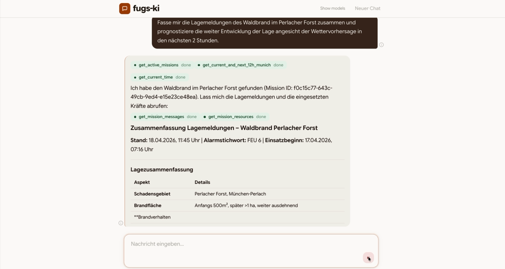
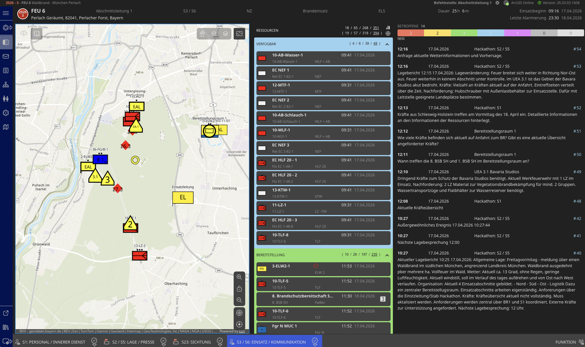
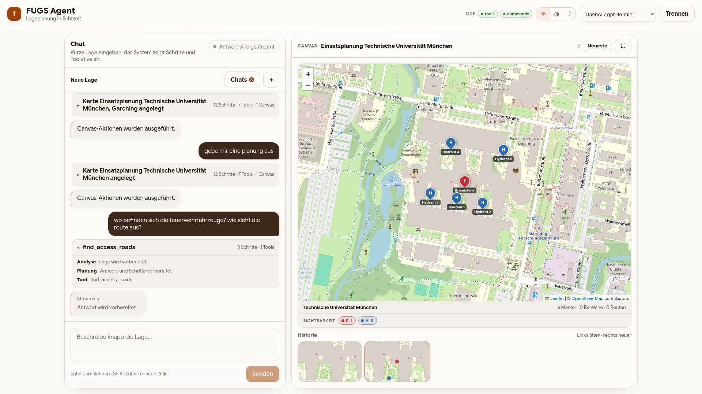
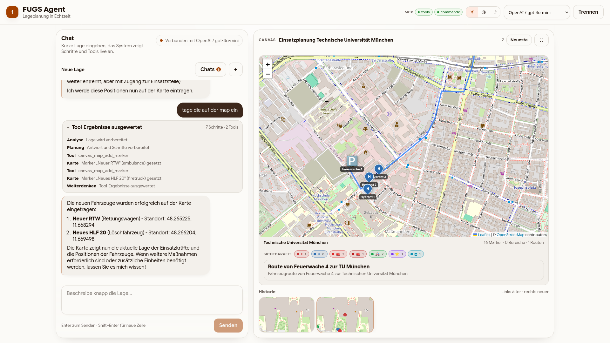
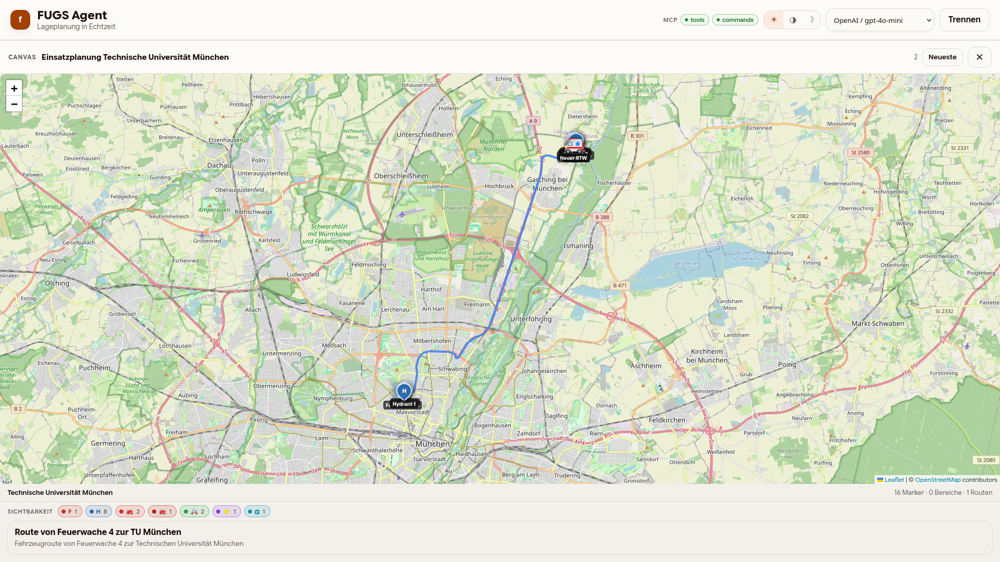
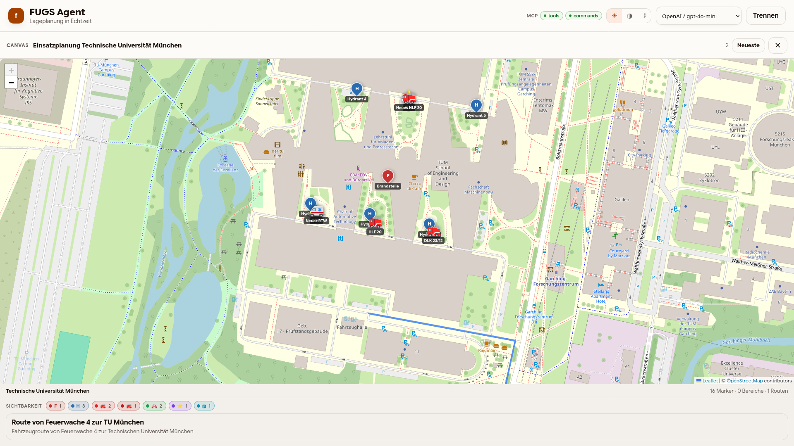
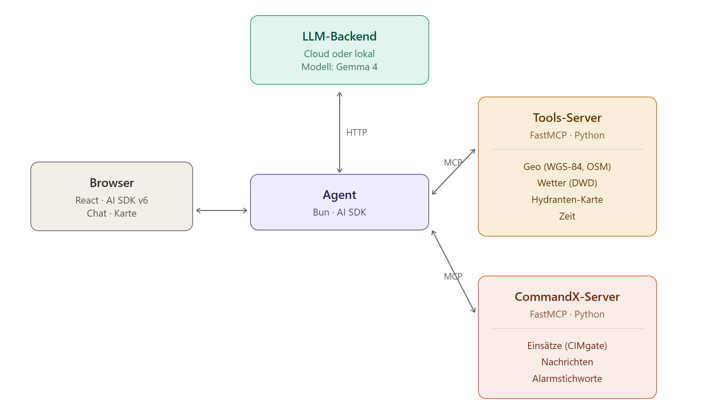
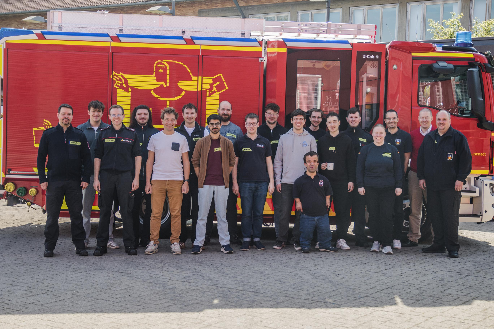

<div id="top">

<!-- HEADER STYLE: CLASSIC -->
<div align="center">

# FUGS&KI — Fuehrungsunterstuetzungssystem & KI

<em>Effizientere Notfallreaktion durch intelligente Automatisierung</em>

<!-- BADGES -->


<em>Erstellt mit folgenden Werkzeugen und Technologien:</em>


<br>


</div>
<br>

---

Ein KI-gestuetzter Stabsfuehrungsassistenttechnoligedemonstrator fuer den Feuerwehr-Einsatz. Entstanden beim **[Hackathon2026 der Feuerwehr Muenchen](https://www.ffw-muenchen.de/hackathon2026/)**.

FUGS&KI verbindet eine Chat-Oberflaeche mit einem grossen Sprachmodell (LLM) und gibt diesem ueber das [Model Context Protocol (MCP)](https://modelcontextprotocol.io/) Zugriff auf Einsatzdaten, Geodaten, Wetterdaten und Nachrichtenfunktionen — so wird die KI zum Werkzeug fuer die Stabsarbeit.

## Features

- **Chat-Interface** — Streaming-Chat mit waehlbarem LLM (lokal oder remote, OpenAI-kompatibel) und Kartenansicht
- **Einsatzdaten** — Zugriff auf Einsaetze, Einsatzmittel und Alarmstichworte ueber CIMgate
- **Nachrichten** — Lesen und Senden von Einsatz-Nachrichten direkt aus dem Chat
- **Geodaten** — Entfernungsberechnung (WGS-84) und OpenStreetMap-Abfragen (Overpass API)
- **Wetterdaten** — Aktuelle Temperatur und 12h-Vorhersage vom Deutschen Wetterdienst (DWD)
- **Knowledge Hub** — Hochladen und Verwalten von Dokumenten; automatische Indexierung als Embeddings fuer kontextuelle Abfragen

### Knowledge Hub

Die Knowledge Hub ermöglicht es, Feuerwehr-relevante Dokumente (z.B. Einsatzrichtlinien, Prozessdokumentationen) hochzuladen. Diese werden automatisch mit einem Embedding-Service indexiert und in einer Vektordatenbank (Qdrant) gespeichert. Bei Abfragen nutzt die KI das Retrieval-Augmented Generation (RAG) Verfahren, um relevante Dokumenten-Inhalte kontextabhängig einzubeziehen.

- **Admin-Interface** — Dokumente verwalten, hochladen, löschen
- **Automatische Indexierung** — PDF und Dokumenten-Verarbeitung mit Embeddings
- **Kontextuelle Abfragen** — KI bezieht Dokumenten-Wissen in Chat-Antworten ein

### Demo

#### Waldbrand Perlacher Forst (agent)

<div align="center">




</div>

**Videos:** [▶ CommandX](./media/demo_wildfire_perlacher_forst_Commmandx.mov) · [▶ Übergabe & Lagebild](./media/demo_wildfire_perlacherforst_handover_comprehension.mov) · [▶ Instagram-Post](./media/demo_wildfire_perlacherforst_instagram.mov) · [▶ Pressemitteilung](./media/demo_wildfire_perlacherforst_instagram_press_statement.mov)


#### TUM Einsatz (agentv2)

<div align="center">






</div>

**Video:** [▶ Hydrants Munich Demo](./media/demo_hydrants_munich.mp4)


## Architektur

<div align="center">



</div>

## Externe Repos (erforderlich)

Zwei MCP-Dienste werden als separate Git-Repositories eingebunden und müssen
vor dem ersten Start in das Projektverzeichnis geklont werden:

| Verzeichnis | Repository | Beschreibung |
|---|---|---|
| `wetterdienst/` | https://github.com/fschir/WetterdienstMCPServer | DWD-Wetterdaten MCP-Server |
| `db-timetable/` | https://github.com/jorekai/db-timetable-mcp | Deutsche Bahn Fahrplan MCP-Server |

```bash
# Im Wurzelverzeichnis dieses Repos:
git clone https://github.com/fschir/WetterdienstMCPServer wetterdienst
git clone https://github.com/jorekai/db-timetable-mcp db-timetable
```

> **Hinweis:** `docker compose up --build` schlägt fehl, wenn diese Verzeichnisse fehlen.

## Quick Start

### Mit Docker Compose

```bash
# Externe Repos klonen (einmalig, siehe oben)

# Konfiguration anlegen
cp agent/config.example.json agent/config.json
# config.json bearbeiten: LLM-Endpunkt und API-Keys eintragen

# Fuer CommandX: CIMgate-Zugangsdaten hinterlegen
cp commandx/.env.example commandx/.env
# .env bearbeiten

# Fuer DB-Fahrplan: API-Key hinterlegen
cp db-timetable/.env.example db-timetable/.env
# .env bearbeiten: DB_API_KEY eintragen

# Stack starten
docker compose up --build
```

Die Anwendung ist dann unter `http://localhost:3001` erreichbar.

### Manuelle Entwicklung

Voraussetzungen: [Bun](https://bun.sh), [uv](https://docs.astral.sh/uv/)

```bash
# Agent (Frontend + Backend)
cd agent && bun install && bun run dev

# Tools-Server
cd tools && uv sync && uv run python main.py

# CommandX-Server
cd commandx && uv sync && uv run python main.py
```

Ausfuehrliche Entwicklerdokumentation: [`docs/DEV-DOCS.md`](docs/DEV-DOCS.md)

## Supported Hardware

Beim Hackathon stand als Entwicklungs- und Demo-System ein **Framework Desktop DIY Edition** mit **AMD Ryzen AI Max+ 395** und **128 GB RAM** zur Verfuegung. Auf diesem System wurde das LLM bislang lokal ausgefuehrt.

### AMD Referenzsystem: Framework Desktop DIY Edition

- **Rechenplattform** — AMD Ryzen AI Max+ 395
- **Prozessorarchitektur** — AMD x86-64 APU
- **CPU-Konfiguration** — `16 Kerne / 32 Threads`
- **Arbeitsspeicher** — `128 GB LPDDR5x-8000`
- **Massenspeicher** — `2x M.2 2280 NVMe PCIe 4.0 x4`
- **Einordnung** — bisherige Entwicklungs- und Demo-Plattform fuer lokal ausgefuehrte LLMs

### NVIDIA Referenzsystem: DGX Spark

- **Rechenplattform** — NVIDIA GB10 Grace Blackwell Superchip
- **Prozessorarchitektur** — Arm CPU + Blackwell GPU
- **CPU-Konfiguration** — `20 Kerne / 20 Threads` (`10x Cortex-X925` + `10x Cortex-A725`)
- **Arbeitsspeicher** — `128 GB LPDDR5x` Unified Memory
- **Massenspeicher** — `4 TB NVMe M.2`
- **Praxiswert** — etwa `~60 Token/s` in dieser FUGS&KI-Konfiguration

Der beobachtete Durchsatz auf dem DGX Spark wurde auch dann erreicht, wenn der komplette Docker-Stack inklusive aller eingesetzten MCP-Server auf demselben System deployed war.

## Contributors

Siehe [contributors.md](contributors.md) fuer die vollstaendige Liste aller Mitwirkenden.

<div align="center">



</div>

## Lizenz

MIT
